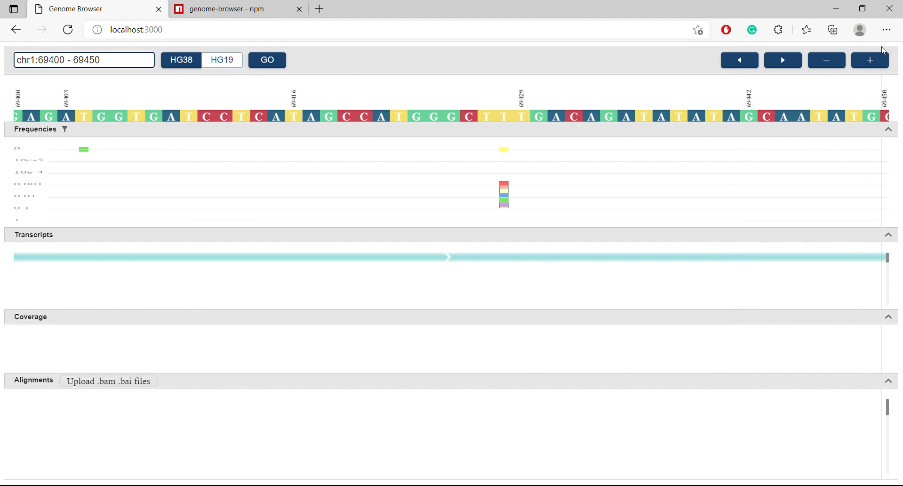

<div id="top"></div>
<!--
*** Thanks for checking out the Best-README-Template. If you have a suggestion
*** that would make this better, please fork the repo and create a pull request
*** or simply open an issue with the tag "enhancement".
*** Don't forget to give the project a star!
*** Thanks again! Now go create something AMAZING! :D
-->

<!-- PROJECT SHIELDS -->
<!--
*** I'm using markdown "reference style" links for readability.
*** Reference links are enclosed in brackets [ ] instead of parentheses ( ).
*** See the bottom of this document for the declaration of the reference variables
*** for contributors-url, forks-url, etc. This is an optional, concise syntax you may use.
*** https://www.markdownguide.org/basic-syntax/#reference-style-links
-->
<!-- [![Contributors][contributors-shield]][contributors-url]
[![Forks][forks-shield]][forks-url]
[![Stargazers][stars-shield]][stars-url]
[![Issues][issues-shield]][issues-url]
[![MIT License][license-shield]][license-url]
[![LinkedIn][linkedin-shield]][linkedin-url] -->

<!-- PROJECT LOGO -->
<br />
<div align="center">
    
  <h3 align="center">Genome Browser</h3>

  <p align="center">
    Genome Browser is an interative tools to visualize and analyze genomic data.
    <!-- <br />
    <a href="https://github.com/othneildrew/Best-README-Template"><strong>Explore the docs »</strong></a>
    <br /> -->
    <br />
    <a href="https://youtu.be/jPPwD95kp28">View Demo</a>
    ·
    <a href="https://www.npmjs.com/package/genome-browser">View Package</a>
    .
    <a href="https://github.com/lebinh190998/genome-browser/issues">Report Bug</a>
    ·
    <a href="https://github.com/lebinh190998/genome-browser/issues">Request Feature</a>
  </p>
</div>

<!-- TABLE OF CONTENTS -->
<details>
  <summary>Table of Contents</summary>
  <ol>
    <li>
      <a href="#about-the-project">About The Project</a>
      <ul>
        <li><a href="#built-with">Built With</a></li>
      </ul>
    </li>
    <li>
      <a href="#getting-started">Getting Started</a>
      <ul>
        <!-- <li><a href="#prerequisites">Prerequisites</a></li> -->
        <li><a href="#scripts">Scripts</a></li>
      </ul>
    </li>
    <li><a href="#use-as-a-package">Use as a package</a></li>
    <!-- <li><a href="#roadmap">Roadmap</a></li> -->
    <li><a href="#contributing">Contributing</a></li>
    <!-- <li><a href="#license">License</a></li> -->
    <li><a href="#contact">Contact</a></li>
    <!-- <li><a href="#acknowledgments">Acknowledgments</a></li> -->
  </ol>
</details>

<!-- ABOUT THE PROJECT -->

## About The Project

<a href="https://www.youtube.com/watch?v=jPPwD95kp28&ab_channel=BinhLe">
  
</a>

Inspired by "igv" and "varsome" genome browsers, I built an interactive genome browser tool from scratch using Reactjs which bioinformatics researchers can visualize and analyze their data.

<p align="right">(<a href="#top">back to top</a>)</p>

### Built With

Frameworks/libraries used to bootstrap this project.

- [React.js](https://reactjs.org/)
- [Python](https://www.python.org/)
- [C++](https://www.cplusplus.com/)
- [HTML Canvas](https://developer.mozilla.org/en-US/docs/Web/API/Canvas_API)
- [MaterialUI](https://mui.com/)

<p align="right">(<a href="#top">back to top</a>)</p>

<!-- GETTING STARTED -->

## Getting Started

To get a local copy up and running follow these simple example steps.

### Scripts

1. Clone the repo
   ```sh
   git clone https://github.com/lebinh190998/genome-browser.git
   ```
2. Install NPM packages
   ```sh
   npm install
   ```
3. Run server file
   ```sh
   cd server/
   ```
   ```sh
   python run genome_browser_server.py
   ```
4. Run locally
   ```sh
   npm start
   ```
5. Build production version (Optional)
   ```sh
   npm run build
   ```

<p align="right">(<a href="#top">back to top</a>)</p>

<!-- USAGE EXAMPLES -->

## Use as a package

1. Download genome-browser package
   ```sh
   npm install genome-browser
   ```
2. Import into your project
   ```js
   import { GenomeBrowserApp } from 'genome-browser';
   ```
3. Use the application as a component
   ```js
   <div>
     <GenomeBrowserApp />
   </div>
   ```
4. Some useful props you can use

   a. Choose desired chromosome

   ```js
   <GenomeBrowserApp chrNum='chr1' />
   ```

   b. Choose desired human genome: 'hg38' or 'hg19'

   ```js
   <GenomeBrowserApp id='hg38' />
   ```

   c. Host your own server with your genome data

   ```js
   <GenomeBrowserApp serverUrl='http://3.143.149.107:8000' />
   ```

   d. Choose your preferred starting and ending positions:

   ```js
   <GenomeBrowserApp pos1='1287123' pos2='1287193' />
   ```

<p align="right">(<a href="#top">back to top</a>)</p>

<!-- CONTRIBUTING -->

## Contributing

Contributions are what make the open source community such an amazing place to learn, inspire, and create. Any contributions you make are **greatly appreciated**.

If you have a suggestion that would make this better, please fork the repo and create a pull request. You can also simply open an issue with the tag "enhancement".
Don't forget to give the project a star! Thanks again!

1. Fork the Project
2. Create your Feature Branch (`git checkout -b feature/AmazingFeature`)
3. Commit your Changes (`git commit -m 'Add some AmazingFeature'`)
4. Push to the Branch (`git push origin feature/AmazingFeature`)
5. Open a Pull Request

<p align="right">(<a href="#top">back to top</a>)</p>

<!-- LICENSE -->
<!-- ## License

Distributed under the MIT License. See `LICENSE.txt` for more information.

<p align="right">(<a href="#top">back to top</a>)</p> -->

<!-- CONTACT -->

## Contact

Le Binh - [@lebinh1909](https://www.linkedin.com/in/binhle19/) - lebinh190998@gmail.com

Project Link: [https://github.com/lebinh190998/porfolio](https://github.com/lebinh190998/genome-browser)

<!-- Production: [https://lebinhporfolio.netlify.app/](https://lebinhporfolio.netlify.app/) -->
<p align="right">(<a href="#top">back to top</a>)</p>

<!-- ACKNOWLEDGMENTS -->
<!-- ## Acknowledgments

Use this space to list resources you find helpful and would like to give credit to. I've included a few of my favorites to kick things off!

* [Choose an Open Source License](https://choosealicense.com)
* [GitHub Emoji Cheat Sheet](https://www.webpagefx.com/tools/emoji-cheat-sheet)
* [Malven's Flexbox Cheatsheet](https://flexbox.malven.co/)
* [Malven's Grid Cheatsheet](https://grid.malven.co/)
* [Img Shields](https://shields.io)
* [GitHub Pages](https://pages.github.com)
* [Font Awesome](https://fontawesome.com)
* [React Icons](https://react-icons.github.io/react-icons/search)

<p align="right">(<a href="#top">back to top</a>)</p> -->

<!-- MARKDOWN LINKS & IMAGES -->
<!-- https://www.markdownguide.org/basic-syntax/#reference-style-links -->
<!-- [contributors-shield]: https://img.shields.io/github/contributors/othneildrew/Best-README-Template.svg?style=for-the-badge
[contributors-url]: https://github.com/othneildrew/Best-README-Template/graphs/contributors
[forks-shield]: https://img.shields.io/github/forks/othneildrew/Best-README-Template.svg?style=for-the-badge
[forks-url]: https://github.com/othneildrew/Best-README-Template/network/members
[stars-shield]: https://img.shields.io/github/stars/othneildrew/Best-README-Template.svg?style=for-the-badge
[stars-url]: https://github.com/othneildrew/Best-README-Template/stargazers
[issues-shield]: https://img.shields.io/github/issues/othneildrew/Best-README-Template.svg?style=for-the-badge
[issues-url]: https://github.com/othneildrew/Best-README-Template/issues
[license-shield]: https://img.shields.io/github/license/othneildrew/Best-README-Template.svg?style=for-the-badge
[license-url]: https://github.com/othneildrew/Best-README-Template/blob/master/LICENSE.txt
[linkedin-shield]: https://img.shields.io/badge/-LinkedIn-black.svg?style=for-the-badge&logo=linkedin&colorB=555
[linkedin-url]: https://linkedin.com/in/othneildrew
[product-screenshot]: images/screenshot.png -->
